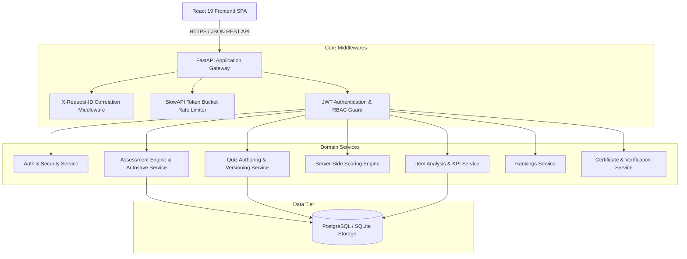
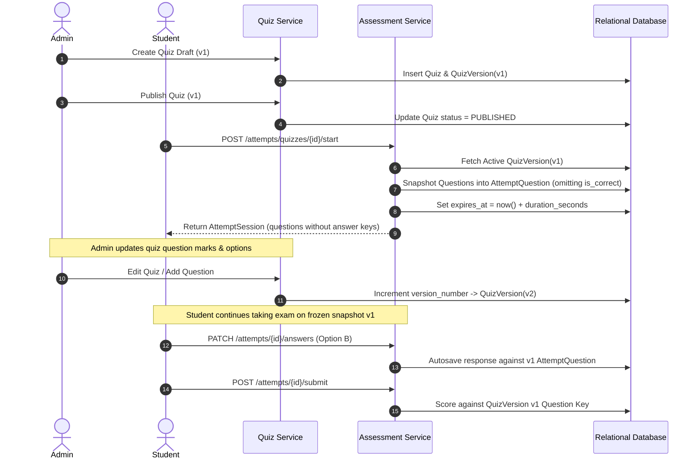
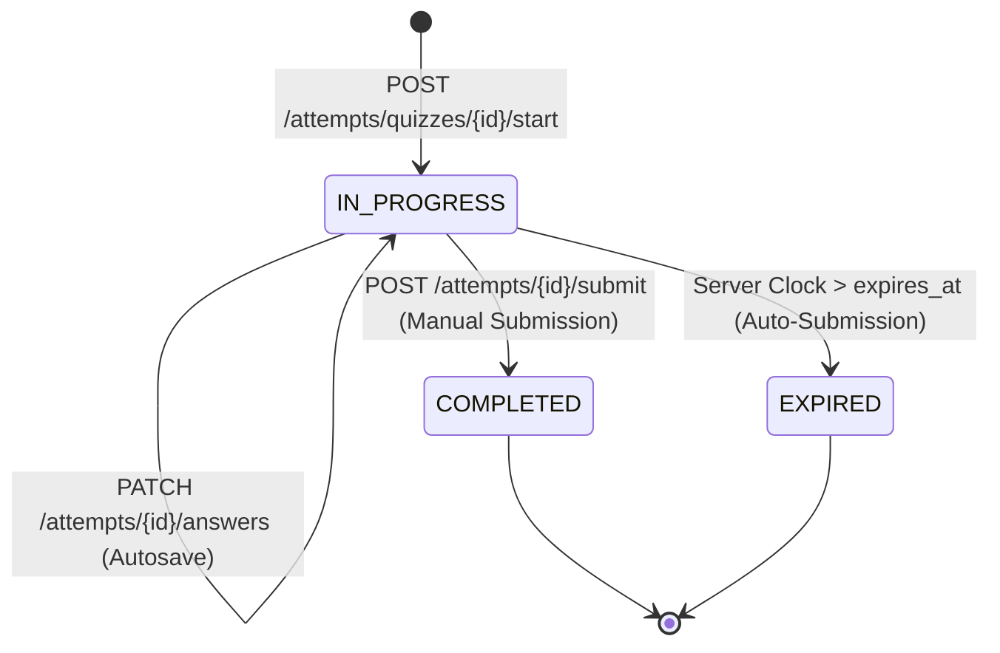

# System Architecture & Technical Specifications

This document outlines the architecture, data flows, state machines, and system invariants governing the ApexAssess Online Assessment Platform.

---

## 1. High-Level System Architecture



---

## 2. Immutable Assessment Versioning

One of the most critical requirements for high-stakes online examinations is that modifying or editing a quiz in the administrator panel must **never mutate ongoing student examination attempts** or alter historical records.



---

## 3. Server-Authoritative Clock & Timer

The assessment countdown is **strictly server-authoritative**:
1. When an attempt starts, `expires_at = UTC_NOW + duration_seconds`.
2. The initial response payload contains `server_time = UTC_NOW` and `expires_at`.
3. The client sets a local interval to decrement the UI display for fluid UX.
4. When any request (`PATCH /answers` or `POST /submit`) arrives at the server, the server validates:
   $$\text{server\_now} \le \text{expires\_at} + \Delta_{\text{grace}}$$
   (where $\Delta_{\text{grace}} = 5\text{ seconds}$ accounts for network packet transit).
5. If $\text{server\_now} > \text{expires\_at}$, the attempt state machine transitions to `EXPIRED` and automatically scores the answers received up to that point.

---

## 4. Assessment Attempt State Machine



### Invariants:
- **Idempotency**: Submitting an attempt that is already `COMPLETED` or `EXPIRED` returns the existing `ResultResponse` without altering scores or records.
- **Answer Key Concealment**: `AttemptQuestion.frozen_options_json` contains:
  ```json
  [
    {"id": "uuid-1", "option_text": "Option A", "position": 1},
    {"id": "uuid-2", "option_text": "Option B", "position": 2}
  ]
  ```
  The boolean `is_correct` is **never** sent to the client during an active test.

---

## 5. Scoring Algorithm

The scoring engine executes purely on the backend. For each `AttemptQuestion` in the attempt:
- **Correct Selection**: $\text{Marks Awarded} = +\text{Question Marks}$
- **Incorrect Selection (Negative Marking Enabled)**: $\text{Marks Awarded} = -\text{Negative Mark Value}$
- **Incorrect Selection (Negative Marking Disabled)**: $\text{Marks Awarded} = 0$
- **Unanswered**: $\text{Marks Awarded} = 0$

$$\text{Final Marks} = \max(0, \sum \text{Marks Awarded})$$
$$\text{Percentage} = \text{round}\left(\frac{\text{Final Marks}}{\text{Total Marks}} \times 100, 2\right)$$
$$\text{Passed} = \text{Percentage} \ge \text{Passing Percentage}$$
