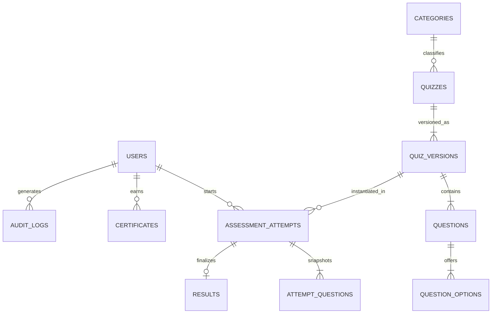

# Database Schema & Entity Design

ApexAssess utilizes a relational relational schema design (tested against SQLite async and production PostgreSQL 16+ via SQLAlchemy 2.0).

---

## 1. Entity-Relationship Diagram



---

## 2. Table Specifications

### `users`
| Column | Type | Constraints | Description |
| :--- | :--- | :--- | :--- |
| `id` | `VARCHAR(36)` | PK | UUID v4 |
| `email` | `VARCHAR(255)` | UNIQUE, NOT NULL, INDEX | Primary login identifier |
| `name` | `VARCHAR(255)` | NOT NULL | User's display / certificate name |
| `hashed_password` | `VARCHAR(255)` | NOT NULL | Bcrypt hashed credential |
| `role` | `VARCHAR(32)` | NOT NULL, DEFAULT 'STUDENT' | `ADMIN` or `STUDENT` |
| `status` | `VARCHAR(32)` | NOT NULL, DEFAULT 'ACTIVE' | `ACTIVE` or `SUSPENDED` |
| `created_at` | `DATETIME` | NOT NULL | Timestamp |
| `updated_at` | `DATETIME` | NOT NULL | Timestamp |

---

### `quizzes` & `quiz_versions`
`quizzes` acts as the stable root identity, while `quiz_versions` stores the immutable test configurations and question associations:

```sql
CREATE TABLE quizzes (
    id VARCHAR(36) PRIMARY KEY,
    title VARCHAR(255) NOT NULL,
    slug VARCHAR(255) UNIQUE NOT NULL,
    description TEXT,
    category_id VARCHAR(36) REFERENCES categories(id) ON DELETE RESTRICT,
    status VARCHAR(32) NOT NULL DEFAULT 'DRAFT',
    thumbnail_url VARCHAR(512),
    created_by VARCHAR(36) REFERENCES users(id),
    created_at TIMESTAMP NOT NULL,
    updated_at TIMESTAMP NOT NULL
);

CREATE TABLE quiz_versions (
    id VARCHAR(36) PRIMARY KEY,
    quiz_id VARCHAR(36) NOT NULL REFERENCES quizzes(id) ON DELETE CASCADE,
    version_number INTEGER NOT NULL DEFAULT 1,
    duration_seconds INTEGER NOT NULL DEFAULT 1800,
    passing_percentage REAL NOT NULL DEFAULT 60.0,
    max_attempts INTEGER NOT NULL DEFAULT 3,
    shuffle_questions BOOLEAN NOT NULL DEFAULT FALSE,
    shuffle_options BOOLEAN NOT NULL DEFAULT FALSE,
    negative_marking_enabled BOOLEAN NOT NULL DEFAULT FALSE,
    negative_mark_value REAL NOT NULL DEFAULT 0.0,
    allow_review_answers BOOLEAN NOT NULL DEFAULT TRUE,
    show_explanations_after_test BOOLEAN NOT NULL DEFAULT TRUE,
    created_at TIMESTAMP NOT NULL,
    UNIQUE (quiz_id, version_number)
);
```

---

### `questions` & `question_options`
```sql
CREATE TABLE questions (
    id VARCHAR(36) PRIMARY KEY,
    quiz_version_id VARCHAR(36) NOT NULL REFERENCES quiz_versions(id) ON DELETE CASCADE,
    question_text TEXT NOT NULL,
    question_type VARCHAR(32) NOT NULL DEFAULT 'MCQ_SINGLE',
    marks REAL NOT NULL DEFAULT 1.0,
    difficulty VARCHAR(32) NOT NULL DEFAULT 'MEDIUM',
    explanation TEXT,
    position INTEGER NOT NULL DEFAULT 1,
    created_at TIMESTAMP NOT NULL,
    updated_at TIMESTAMP NOT NULL
);

CREATE TABLE question_options (
    id VARCHAR(36) PRIMARY KEY,
    question_id VARCHAR(36) NOT NULL REFERENCES questions(id) ON DELETE CASCADE,
    option_text TEXT NOT NULL,
    position INTEGER NOT NULL DEFAULT 1,
    is_correct BOOLEAN NOT NULL DEFAULT FALSE,
    created_at TIMESTAMP NOT NULL
);
```

---

### `assessment_attempts` & `attempt_questions`
```sql
CREATE TABLE assessment_attempts (
    id VARCHAR(36) PRIMARY KEY,
    user_id VARCHAR(36) NOT NULL REFERENCES users(id) ON DELETE CASCADE,
    quiz_version_id VARCHAR(36) NOT NULL REFERENCES quiz_versions(id),
    status VARCHAR(32) NOT NULL DEFAULT 'IN_PROGRESS',
    started_at TIMESTAMP NOT NULL,
    expires_at TIMESTAMP NOT NULL,
    completed_at TIMESTAMP,
    created_at TIMESTAMP NOT NULL,
    updated_at TIMESTAMP NOT NULL
);

CREATE TABLE attempt_questions (
    id VARCHAR(36) PRIMARY KEY,
    attempt_id VARCHAR(36) NOT NULL REFERENCES assessment_attempts(id) ON DELETE CASCADE,
    question_id VARCHAR(36) NOT NULL REFERENCES questions(id),
    question_order INTEGER NOT NULL,
    frozen_question_text TEXT NOT NULL,
    frozen_options_json TEXT NOT NULL,  -- stores options without 'is_correct'
    marks REAL NOT NULL DEFAULT 1.0,
    selected_option_id VARCHAR(36) REFERENCES question_options(id),
    answered_at TIMESTAMP
);
```

---

## 3. Indexes & Constraints

1. `idx_attempts_user_status` (`user_id`, `status`): Fast retrieval of active sessions for resume checks.
2. `idx_quizzes_category` (`category_id`): Efficient category-filtered browsing.
3. `idx_certificates_code` (`certificate_code`): $O(1)$ certificate verification lookup.
4. `idx_audit_logs_action_created` (`action`, `created_at`): Admin audit stream sorting.
