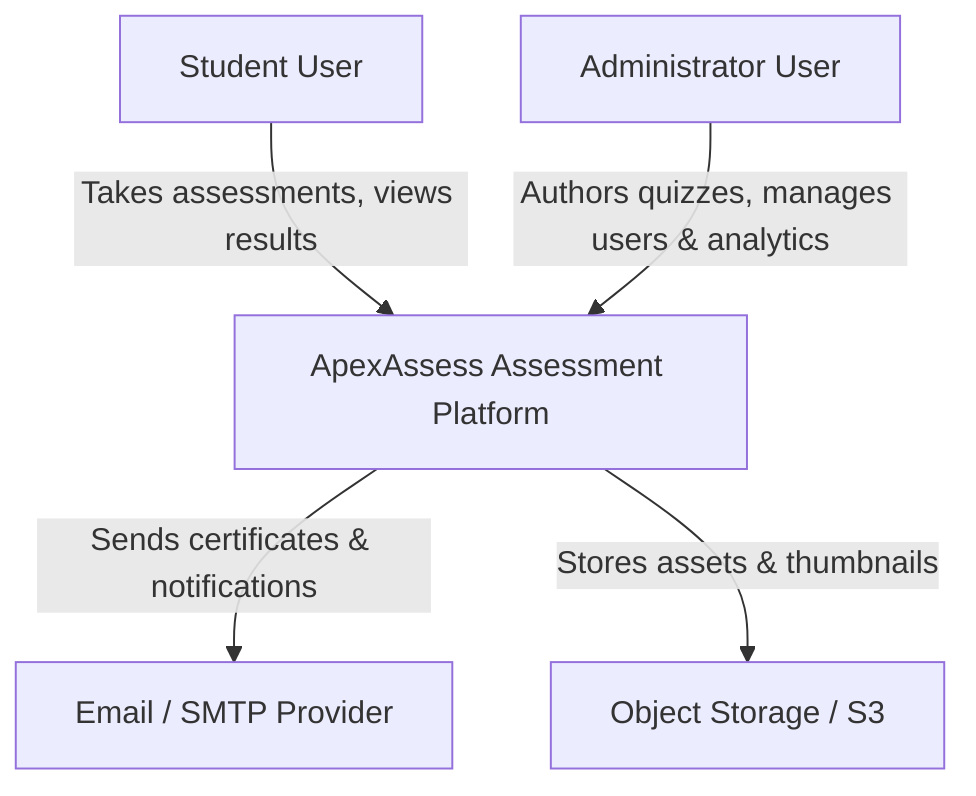
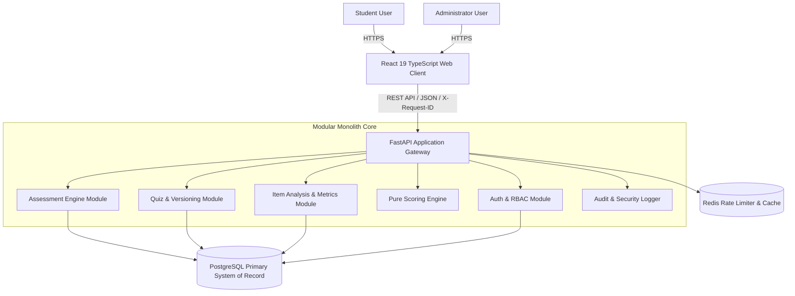

# Software Architecture Document (SAD) — ApexAssess

**Product**: Quiz Management & Online Assessment Platform  
**Document Version**: 1.0  
**Architecture Status**: Production-Oriented  
**Architecture Style**: Modular Monolith  
**Primary Roles**: Admin, Student  
**Frontend**: React 19 + TypeScript  
**Backend**: FastAPI + Python  
**Database**: PostgreSQL 16+ / SQLite (Async aiosqlite)  
**Coordination & Rate Limiting**: SlowAPI / Redis  
**API Standard**: REST / JSON (`/api/v1`)  
**Deployment**: Docker + Docker Compose + Nginx  
**Documentation Standard**: Arc42 structure with C4 views  

---

## 1. Architecture Vision & Invariants

ApexAssess is an enterprise assessment engine providing high transactional consistency, server-authoritative evaluation, and immutable auditability:

$$\text{Quiz} \xrightarrow{} \text{QuizVersion} \xrightarrow{} \text{Attempt} \xrightarrow{} \text{AttemptQuestion Snapshot} \xrightarrow{} \text{Timer} \xrightarrow{} \text{Autosave} \xrightarrow{} \text{Submission} \xrightarrow{} \text{Scoring} \xrightarrow{} \text{Result}$$

---

## 2. C4 Context & Container Views

### 2.1 C4 System Context (Level 1)


### 2.2 C4 Container Diagram (Level 2)


---

## 3. C4 Component & Layer Model (Level 3)

Every business module strictly enforces the unidirectional dependency chain:

$$\text{Router} \longrightarrow \text{Schema (Pydantic)} \longrightarrow \text{Policy / Auth Guard} \longrightarrow \text{Service Layer} \longrightarrow \text{Repository Layer} \longrightarrow \text{SQLAlchemy Model}$$

- **`Router`**: HTTP serialization, status codes, dependency injection.
- **`Schema`**: Strict Pydantic v2 DTO input/output validation.
- **`Policy`**: Object-level authorization (`user_id == current_user.id`) and role guards (`Role.ADMIN`).
- **`Service`**: Domain orchestration, ACID transaction management, and business logic.
- **`Repository`**: Database querying and entity persistence.

---

## 4. Key Architectural Decisions & Failure Invariants

| ID | Title | Architectural Invariant & Strategy |
| :--- | :--- | :--- |
| **ADR-001** | Modular Monolith | Single deployable unit with clear internal module boundaries and shared transactional guarantees. |
| **ADR-002** | PostgreSQL Source of Truth | Relational integrity, foreign key cascades, and row-level locking for atomic attempt finalization. |
| **ADR-003** | Immutable Assessment Versioning | Running tests link to `quiz_version_id` and frozen `AttemptQuestion` records; admin edits never corrupt active exams. |
| **ADR-004** | Server-Authoritative Clock | Test durations and expirations are enforced solely by the server timestamp ($\text{expires\_at}$); local clock tampering is neutralized. |
| **ADR-005** | Answer Key Redaction & Pure Scoring | Active attempt payloads strip `is_correct`. All scoring is performed server-side by `ScoringService`. |
| **ADR-006** | Idempotent Submissions | Duplicate or concurrent `POST /submit` requests return the canonical existing result without re-scoring or mutating records. |
| **ADR-007** | OWASP Top 10 Defenses | BOLA protection, Mass-Assignment prevention on registration, SlowAPI rate limiting, and single-use SHA-256 reset tokens. |
| **ADR-008** | Structured Observability | `X-Request-ID` correlation middleware, health/readiness probes (`/health`, `/ready`), and immutable administrative audit trails (`audit_logs`). |

---

## 5. Deployment Topology

```text
INTERNET
   │
   ▼
Nginx Reverse Proxy (Port 80)
   ├── /      ──> Compiled React 19 SPA (Static Assets)
   └── /api/  ──> FastAPI Backend (Port 8000)
                    ├── PostgreSQL Database (Port 5432)
                    └── Redis / Rate Limiter
```

---

## 6. Verification Status

- **Automated Tests**: 12/12 passing asynchronous Pytest tests across scoring, timer expiry, versioning, BOLA, BFLA, and master E2E simulation.
- **Frontend Build**: Zero TypeScript errors (`npm run build` cleanly generates production bundle).
- **Environment**: Externalized settings via `pydantic-settings` (`.env.example`).
